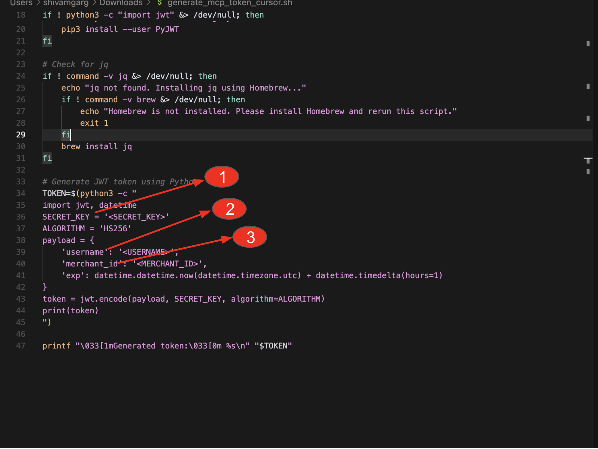

# Paytm MCP Server

Paytm MCP Server enables AI agents and developers to securely access Paytm's Payments and Business Payments [APIs](https://www.paytmpayments.com/docs) via the [Model Context Protocol (MCP)](https://modelcontextprotocol.io/introduction). It allows smart, contextual automation across all payment workflows

## Features

- **Smart Payment Ops**: Automate routine payment workflows like refunds, settlement tracking, and transaction status checks using AI agents powered by Paytm MCP

- **Context-Aware AI Assistants**: Create intelligent tools that can fetch and explain transactions, initiate payouts, or manage payment links—all through simple natural language prompts

- **Developer Productivity**: Supercharge developer efficiency by enabling Paytm API calls (e.g. "Create a ₹500 payment link") directly via terminals, chat-based UIs, or AI IDE plugins

- **Agentic AI Payments**: Enable agentic AI payments, build enhanced bot led shopping experience through Paytm MCP server

## Deployment Options

This MCP server can be used in **two modes**:

1.  **Remote MCP (Recommended)** - Hosted by Paytm with zero setup
2.  **Local MCP** - Run and test tools on your local machine

## Tools

| Tool                                 | Description                                                                                                                      | API                                                                                                                               |
| ------------------------------------ | -------------------------------------------------------------------------------------------------------------------------------- | --------------------------------------------------------------------------------------------------------------------------------- |
| `create_link`                        | Create a new payment link                                                                                                        | [Create Link API](https://www.paytmpayments.com/docs/api/create-link-api?ref=paymentLinks)                                        |
| `fetch_link`                         | Fetch details of a payment link                                                                                                  | [Fetch Link API](https://www.paytmpayments.com/docs/api/fetch-link-api?ref=paymentLinks)                                          |
| `fetch_transaction`                  | Fetch transaction details for a link                                                                                             | [Fetch Transaction API](https://www.paytmpayments.com/docs/api/fetch-transaction-link-api?ref=paymentLinks)                       |
| `fetch_order_list`                   | Fetch a list of orders within a date range of 30 days                                                                            | [Order List API](https://www.paytmpayments.com/docs/api/order-list-api)                                                           |
| `initiate_refund`                    | Initiate a refund for a specific transaction                                                                                     | [Initiate Refund API](https://www.paytmpayments.com/docs/api/initiate-refund-api)                                                 |
| `check_refund_status`                | Check status of a previously initiated refund                                                                                    | [Check refund status API](https://www.paytmpayments.com/docs/api/check-refund-status-api)                                         |
| `fetch_refund_list`                  | Fetch a list of refunds within a date range of 30 days                                                                           | [Fetch Refund List API](https://www.paytmpayments.com/docs/api/fetch-refund-list-api)                                             |
| `get_settlement_summary`             | Retrieves the overall summary details of a payout corresponding to a single date, a date range, or a payout ID                   | [Get Settlement Summary API](https://www.paytmpayments.com/docs/api/settlement-summary-api?ref=settlement)                        |
| `get_settlement_detail`              | Retrieves a detailed or transactional view of all settled transactions at the payout level, based on a date range or a payout ID | [Get Settlement details API](https://www.paytmpayments.com/docs/api/settlement-detail-api?ref=settlement)                         |
| `get_settlement_order_details`       | Retrieves settlement details at an order level, based on a specified payout date and order ID                                    | [Get Settlement Order Details API](https://www.paytmpayments.com/docs/api/settlement-order-detail-api?ref=settlement)             |
| `get_settlement_transaction_details` | Retrieves settlement details of an order based on a transaction ID                                                               | [Get Settlement Transaction Details API](https://www.paytmpayments.com/docs/api/settlement-transaction-detail-api?ref=settlement) |

# **Remote MCP (Recommended)**

Use this mode to connect directly to Paytm's hosted MCP instance without setting up your own server.

**Step 1: Request Access**

To onboard onto Remote MCP, please **drop an email to**: devsupport@paytmpayments.com

In your request, include your intent to connect to Remote MCP. In response, you will receive:

- **Client ID**
- **Secret Key**

You will also need your **Merchant ID**, which you can retrieve from the [Paytm Merchant](https://www.paytmpayments.com//docs/getting-started) dashboard.

**For Cursor**

**1. Download the Helper Script**

Get the generate_mcp_token_cursor.sh file from this repository.

**2. Edit the Script**

Open the downloaded generate_mcp_token_cursor.sh file in a text editor and modify the below variables as follows:

- SECRET_KEY (line 36) : Use the **Secret Key** received via email
- USERNAME (line 39) : Use the **Client ID** received via email
- MERCHANT_ID (line 40) : Use your **existing Paytm Merchant ID**



**3. Make the Script Executable**

In your terminal, run:

```bash
   chmod +x generate_mcp_token_cursor.sh
```

**4. Run the Script**

```bash
   sh generate_mcp_token_cursor.sh
```

This will output a valid Authorization Token (JWT).

**5. Configure MCP in Cursor**

Open your MCP settings inside Cursor and paste the following config:

json

Inside your cursor settings in MCP, add this config.

```bash
   {
      "mcpServers": {
         "Paytm MCP Server": {
            "url": "https://paytm-mcp.pg2prod.paytm.com/sse/",
            "headers": {
            "client-id": "<Client ID>",
            "Authorization": "Bearer <Authorization Token>"
            }
         }
      }
   }
```

Make sure to replace <Your Client ID> and <Your JWT Token> with actual values.

# **Local MCP (Self-Hosted)**

If you'd prefer to run the MCP server locally (for testing or sandbox development), follow the instructions below.

## Prerequisites

- [Python 3.12](https://www.python.org/downloads/) or higher
- [Paytm Merchant credentials](https://www.paytmpayments.com//docs/getting-started): `PAYTM_MID` and `PAYTM_KEY_SECRET`
- [uv](https://github.com/astral-sh/uv) (a fast Python package installer and runner)
- [Claude Desktop](https://www.anthropic.com/claude) (for running and managing the server)

## Installation

### Option 1: Automated Setup (Recommended)

1. Download the setup.sh script above for automated installation and configuration and follow the below steps:

2. Run the following in your terminal (Mac/Unix-based):

### Make the script executable

```bash
# Make the script executable
chmod +x setup.sh

# Run the setup script
./setup.sh
```

The script will:

1. Check for required dependencies (Python 3.12+, uv, Claude Desktop)
2. Clone or update the repository
3. Create and activate a virtual environment
4. Install all required dependencies
5. Create a .env file template for Paytm credentials

Note: On Windows, use Git Bash or WSL to run the script, or follow manual installation.

### Option 2: Manual Installation

1. **Clone the repository:**

   ```bash
   git clone https://github.com/paytm/payment-mcp-server.git
   cd payment-mcp-server
   ```

2. **Create and activate a virtual environment:**

   ```bash
   uv venv
   source .venv/bin/activate
   ```

3. **Install dependencies:**
   ```bash
   uv pip install .
   ```

## Running the MCP Server with Claude Desktop

This server is designed to be launched and managed through Claude Desktop. You do not need to run the server manually from the command line.

### Sample `claude_desktop_config.json`

Place this file in your project root or as required by Claude Desktop:

```json
{
  "mcpServers": {
    "paytm-mcp-server": {
      "command": "uv path",
      "args": ["--directory", "path to project", "run", "paytm_mcp.py"],
      "env": {
        "PAYTM_MID": "****************",
        "PAYTM_KEY_SECRET": "************"
      }
    }
  }
}
```

## Tips:

1. On Mac:

   - Run `which uv` to get the command path
   - Run `pwd` to get the project path

2. On Windows:

   - Run `where uv` to get the command path
   - Run `cd` to get the project path

   Ensure the paytm_mcp.py file exists in the given path.

3. The env section should contain your actual Paytm credentials (Paytm MID and Paytm Key Secret)

## Next Steps

1. Update the claude_desktop_config.json with your Paytm credentials
2. Restart the server using Claude Desktop
3. Begin interacting with Paytm APIs using your AI agents

## License

This project is licensed under the MIT License - see the [LICENSE](LICENSE) file for details.

The MIT License is a permissive license that allows you to:

- Use the code commercially
- Modify the code
- Distribute the code
- Use the code privately
- Sublicense the code

The only requirement is that the license and copyright notice must be included in all copies or substantial portions of the software.

Need help? Raise an issue or explore the [Paytm Documentation](https://www.paytmpayments.com/docs)
